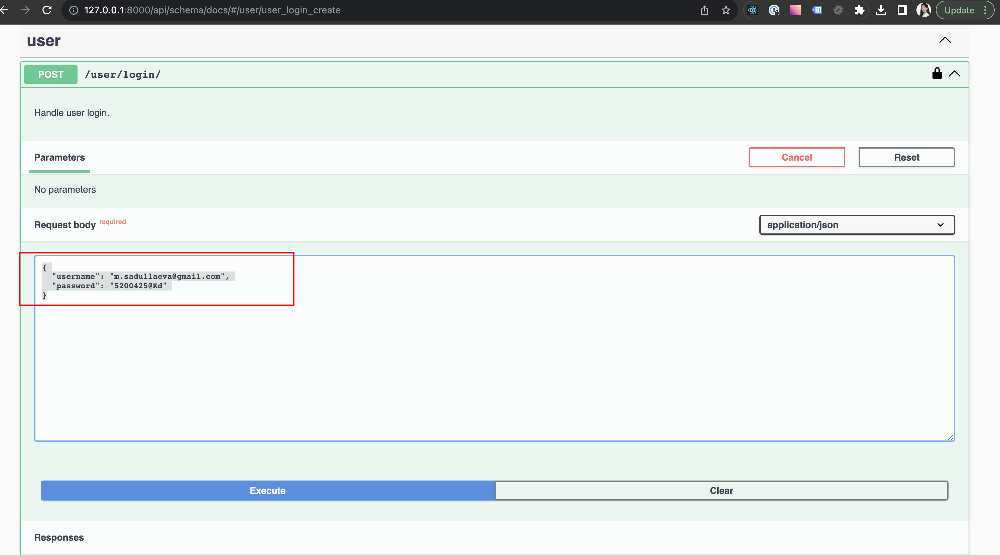
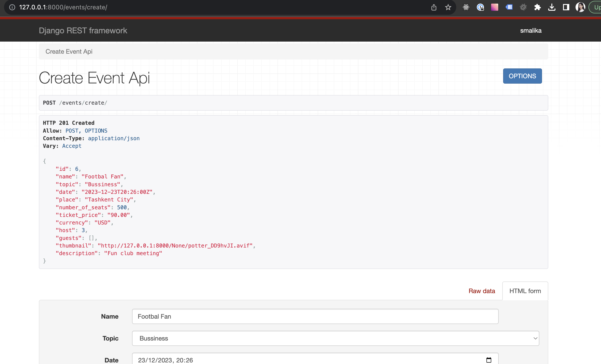
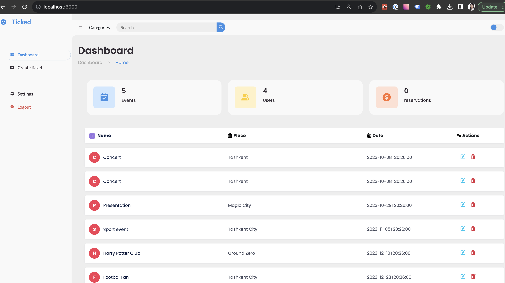
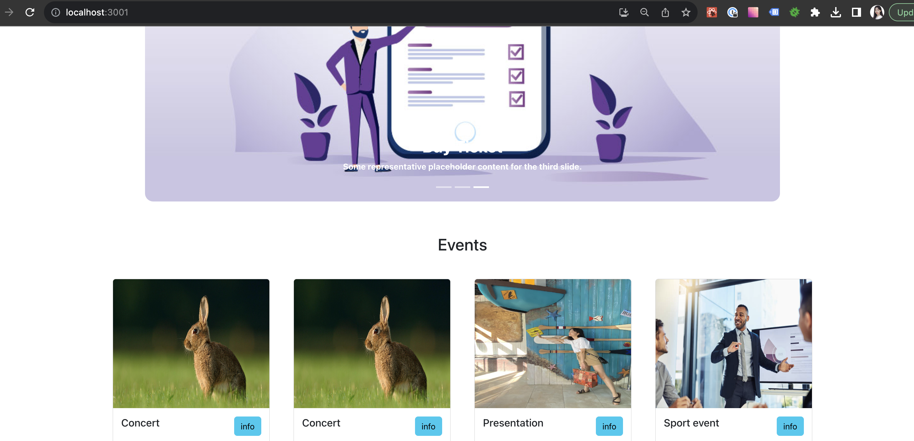

# Description

## 1. Clone
   - ticket-admin > npm install/npm start
   - ticket-user > npm install/npm start
## 2. Registartion

## 3. Login to be able to create tickets

   - use credentials from step 2
## 4. Create an event

## 5. Login to admin panel

  - use credentials from step 2
## 6. Check available tickets

### *dont forget to run python.exe manage.py runserver*